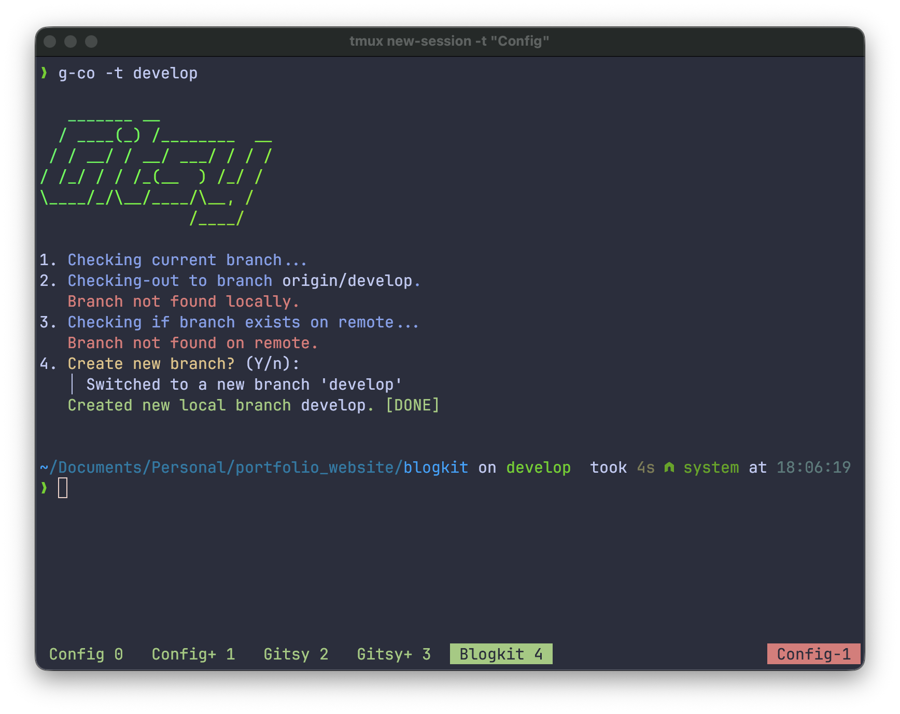

# gitsy


A set of bash utilities for managing Git repositories with ease. Provides user-friendly commands with helpful prompts, color-coded outputs, and automation.

## Documentation

For complete documentation, usage examples, and detailed command reference, visit the [gitsy documentation website](https://gitsy-56895.web.app).

## System Requirements

- Node.js >= 12.0.0
- Bash shell
- Git
- Supported OS: macOS, Linux

## Available Commands

| Command | Description |
|---------|-------------|
| `g-s` | Show git status with colorful output |
| `g-cb` | Display current branch name |
| `g-co` | Checkout branch with optional stashing |
| `g-pull` | Pull changes from remote branch |
| `g-push` | Push changes to remote (supports force push) |
| `g-wa` | Create git worktree with automatic repository restructuring |
| `g-wr` | Remove git worktree |
| `g-db` | Delete branch locally and remotely |
| `g-dlc` | Discard last commit |
| `g-rmf` | Stash working directory changes |
| `g-rto` | Reset to remote branch |
| `g-diff` | Compare changes between branches |

## Installation

Install gitsy globally with npm:

```bash
npm install -g gitsy
```

That's it! All commands (`g-s`, `g-co`, `g-pull`, etc.) will be available immediately.

### Prerequisites

You'll also need these dependencies installed:

```bash
# macOS
brew install git figlet lolcat

# Ubuntu/Debian
sudo apt-get install git figlet lolcat

# Fedora/RHEL
sudo dnf install git figlet lolcat
```

### Verify Installation

```bash
g-s --help
```

### Troubleshooting

**Commands not found:**
- Ensure npm global bin directory is in your PATH
- Try: `npm uninstall -g gitsy && npm install -g gitsy`

**Missing dependencies:**
- Verify with: `git --version`, `figlet --version`, `lolcat --version`

**Permission errors:**
- Use `sudo npm install -g gitsy` on some systems
- Or configure npm user directory: `npm config set prefix ~/.npm-global`

## Usage

All gitsy commands support the `--help` flag for detailed usage information:

```bash
g-co --help
```

### Quick Examples

**Check git status:**
```bash
g-s
```

**Checkout a branch:**
```bash
g-co -t feature-branch
```

**Create a new worktree:**
```bash
g-wa -t new-feature
```

### Understanding g-wa: Worktree Management

`g-wa` intelligently manages git worktrees with automatic repository restructuring:

**First-time setup:**
- Automatically detects if your repository needs restructuring
- Moves your repository into a `main` subdirectory
- Creates a `worktrees` directory for branch isolation
- Provides clear step-by-step feedback throughout the process

**Structure after setup:**
```
your-repo/
├── main/           # Your default branch (main/master)
└── worktrees/      # All feature branch worktrees
    ├── feature_1/
    ├── feature_2/
    └── bugfix_abc/
```

**Key features:**
- Only creates worktrees from the default branch (main/master)
- Automatically sanitizes branch names for directory creation
- Converts paths to absolute paths for clarity
- Checks for existing worktrees to prevent duplicates
- Prompts to create new branches if they don't exist
- Automatically pushes new branches to remote

**Pull latest changes:**
```bash
g-pull
```

**Push changes to remote:**
```bash
g-push
```

**Compare branches:**
```bash
g-diff -s main -t feature-branch
```

For complete command documentation and advanced usage examples, visit the [gitsy documentation website](https://gitsy-56895.web.app).

## Features

- **Interactive prompts** - User-friendly command-line prompts guide you through operations
- **Color-coded output** - Easy-to-read, colorful terminal output powered by lolcat
- **Safety checks** - Built-in validations prevent common git mistakes
- **Automation** - Streamlines complex git workflows into single commands
- **Intelligent worktree management** - Automatic repository restructuring for seamless worktree workflows
- **Branch operations** - Quick branch switching, creation, and deletion
- **Step-by-step feedback** - Clear progress indicators show exactly what's happening

## Contributing

Contributions are welcome! Here's how to contribute:

### Development Setup

1. **Fork and clone** the repository:
   ```bash
   git clone https://github.com/YOUR_USERNAME/gitsy.git
   cd gitsy
   ```

2. **Install dependencies** (git, figlet, lolcat)

3. **Link for local development**:
   ```bash
   npm link
   ```
   This creates symlinks so you can test your changes globally.

4. **Create a feature branch**:
   ```bash
   git checkout -b feature/your-feature-name
   ```

5. **Make your changes** and test thoroughly

6. **Validate syntax**:
   ```bash
   npm test
   ```

7. **Commit and push**:
   ```bash
   git commit -m "Description of your changes"
   git push origin feature/your-feature-name
   ```

8. **Create a Pull Request** on GitHub

### Reporting Issues

Found a bug or have a feature request? Please [open an issue](https://github.com/san-siva/gitsy/issues) with:
- A clear description of the problem or suggestion
- Steps to reproduce (for bugs)
- Expected vs actual behavior
- Your environment (OS, Node version, shell)

## License

This project is licensed under the MIT License. See the LICENSE file for details.

## Author

**Santhosh Siva**
- GitHub: [@san-siva](https://github.com/san-siva)
- Documentation: [gitsy-56895.web.app](https://gitsy-56895.web.app)

## Acknowledgments

Built with:
- [figlet](http://www.figlet.org/) - ASCII art text generator
- [lolcat](https://github.com/busyloop/lolcat) - Rainbow colorizer
- Bash - The GNU Bourne Again Shell
